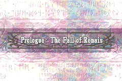
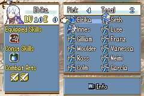
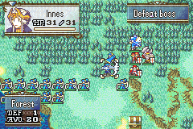

# FE8U c-Skill-System Mokha-build

Project of [Skill-lite](https://github.com/StanHash/SkillsLite.git) and [C-HAX](https://github.com/StanHash/FE-CHAX.git) style FE8U SkillSystem rebuild in C.

## Main Features

- Three-Houses style skill & combat-art system.
- Pick unit skills & combat-arts on prep-screen.
- Three-Houses style level-up, battle-calc.
- Unit Status reworked so that we can get 4 bits buff & debuff status with a modular info table.
- CHAX style buildfile project with better quality and stability, including `c-Str/Mag-Split`, `c-Item-System-Rework`, `c-Battle-System-Rework`, `c-Stat-Screen`, `Post-Action hook`, etc.

## Compiling 

See [Build-Notes](Readme-Files/Build-Notes.md)

## Skills & Combat-Art List

See [Skills-List(en)](Readme-Files/Skills-List(en).md) or [Skills-List(cn)](Readme-Files/Skills-List(cn).md)

## Hacks Note

See [Wizardry-Notes](Readme-Files/Wizardry-Notes.md)

	
## Thanks

See [Credits](Readme-Files/Credits.md)